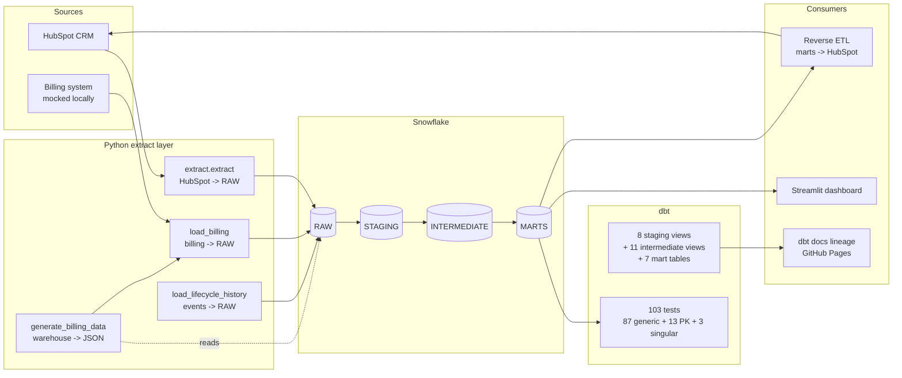

# CRM Analytics Engineering

A production-grade RevOps analytics pipeline. **HubSpot CRM** and a **mock billing source** flow through **Snowflake** and **dbt** into seven analytics marts powering a **Streamlit dashboard**. **GitHub Actions** runs the full pipeline daily, **schema drift detection** guards against silent upstream changes, and **Reverse ETL** pushes computed metrics back into HubSpot, closing the loop between analytics and operations.


| | |
|---|---|
| 📊 Live dashboard | https://crm-analytics-engineering.streamlit.app/ |
| 🔗 dbt lineage | https://lucaslimaa2.github.io/crm-analytics-engineering/ |
| 📂 Metric catalog | [`dbt/models/marts/_metrics.yml`](dbt/models/marts/_metrics.yml) · [`docs/metrics_glossary.md`](docs/metrics_glossary.md) |
| 💰 Cost optimization | [`docs/cost_optimization.md`](docs/cost_optimization.md) |

---

## What this is

Most analytics portfolios stop at "I built a dashboard." This project covers the whole pipeline a real RevOps team owns: two upstream sources, the warehouse, the transformation layer, the orchestration, the dashboard, AND the reverse ETL that pushes computed metrics back into the CRM where sales actually work.

Revenue metrics (MRR, ARR, churn) come from the billing source joined to CRM deals, mirroring the real-world split where the CRM owns the sales process and the billing system owns the money. The dashboard never recomputes a metric: every number traces back to a single SQL definition in the dbt mart layer, cataloged in [`_metrics.yml`](dbt/models/marts/_metrics.yml). That discipline ends the "whose MRR is right?" problem.

Everything runs on a free Snowflake trial, a free HubSpot developer portal, and free GitHub Actions minutes, so the architecture is honest about cost trade-offs (X-Small warehouse, 60s auto-suspend, deliberate materialization choices) without pretending to enterprise scale.

---

## Architecture



**Highlights:**
- **Two sources, not one.** HubSpot CRM + billing system, joined at `fct_revenue` (CRM context + billing numbers)
- **Medallion architecture.** Each layer reads only from the previous one; cleaning happens in `intermediate/`, business logic in `marts/`
- **Seven marts.** `dim_accounts`, `dim_contacts`, `fct_deals`, `fct_pipeline`, `fct_revenue`, `fct_funnel`, `fct_account_health`
- **Clustering on time-queried facts.** `fct_revenue` by `metric_month`, `fct_deals` by `close_date_day`, `fct_funnel` by `entered_date`
- **Reverse ETL closes the loop.** Health score + ARR pushed back to HubSpot as custom Company properties

---

## Tech stack

| Layer | Tools |
|---|---|
| Sources | HubSpot CRM (free dev portal), mock billing system (Stripe analogue) |
| Extraction | Python 3.12, `snowflake-connector-python`, `requests`, `python-dotenv` |
| Warehouse | Snowflake free trial, 4 schemas (RAW / STAGING / INTERMEDIATE / MARTS), 4 RBAC roles |
| Transformation | dbt-core 1.8 + dbt-snowflake 1.8 |
| Tests | pytest (49) + dbt tests (103) |
| Reverse ETL | Custom Python, batch HubSpot Companies API |
| Orchestration | GitHub Actions (3 workflows: daily pipeline, weekly seed, schema drift) |
| Dashboard | Streamlit + Plotly, hosted on Streamlit Community Cloud |
| Docs | dbt docs (lineage graph) hosted on GitHub Pages |

---

## Live artifacts

| | URL |
|---|---|
| Dashboard | https://crm-analytics-engineering.streamlit.app/ |
| Lineage graph + per-model docs | https://lucaslimaa2.github.io/crm-analytics-engineering/ |
| Source code | https://github.com/lucaslimaa2/crm-analytics-engineering |

---

## Project structure

```
crm-analytics-engineering/
├── .github/workflows/
│   ├── pipeline.yml             daily 06:00 UTC, full ETL + reverse push
│   ├── weekly_seed.yml          Mondays 07:00 UTC, adds new mock data
│   ├── schema_drift.yml         daily 05:30 UTC + on PR, drift detection
│   └── dbt_docs.yml             on push to dbt/, publishes lineage to GH Pages
├── infra/
│   ├── snowflake_setup.sql      warehouses + schemas + roles, idempotent
│   └── expected_schema.json     committed HubSpot property baseline
├── seed/
│   ├── generate_mock_data.py    deterministic Faker, ~813 records + dirty layer
│   ├── generate_billing_data.py reads warehouse won deals -> subscriptions JSON
│   ├── seed_hubspot.py          POSTs to HubSpot; --weekly delta seed
│   ├── mock_data.json           CRM seed payload
│   ├── mock_billing.json        billing seed payload (regenerated daily by CI)
│   └── .hubspot_ids.json        state file (committed; CI commits back updates)
├── extract/
│   ├── hubspot_client.py        paginator + 429/5xx retries
│   ├── extract.py               HubSpot 5 entities -> RAW
│   ├── load_billing.py          billing JSON -> RAW
│   ├── load_lifecycle_history.py lifecycle events -> RAW
│   ├── load_to_snowflake.py     shared MERGE-with-staging-table loader
│   └── schema_drift.py          --snapshot / --check modes
├── dbt/
│   ├── dbt_project.yml          per-folder materialization + warehouse sizing
│   ├── profiles.yml.example     env_var()-driven template
│   ├── models/
│   │   ├── staging/             flatten VARIANT, rename, cast (views)
│   │   ├── intermediate/        dedup, NULL filtering, link cleaning (views)
│   │   └── marts/               7 marts + _metrics.yml semantic catalog (tables)
│   └── tests/                   3 singular business-invariant tests
├── reverse_etl/
│   ├── setup_hubspot_properties.py   one-time custom property creation
│   └── push_to_hubspot.py            fct_account_health -> HubSpot Company props
├── dashboard/
│   └── streamlit_app.py         reads MARTS as REPORTER role
├── tests/
│   ├── test_extract.py          pagination, retries, error handling
│   ├── test_schema_drift.py     diff logic invariants
│   └── test_reverse_etl.py      payload shape, retry behavior
├── docs/
│   ├── metrics_glossary.md      stakeholder-facing metric reference
│   └── cost_optimization.md     warehouse sizing, clustering, query history
├── .streamlit/
│   ├── config.toml              light theme
│   └── secrets.toml.example     credential template
├── requirements.txt             pinned for reproducibility
└── .env.example                 credential template
```

---

## Setup (local dev)

### Prerequisites

- Python 3.12 (Snowflake adapter has no Windows wheel for 3.14)
- A Snowflake account (free trial works)
- A HubSpot developer account with a private app's Service Key (CRM read+write scopes)
- `gh` CLI authenticated for GitHub deployments (optional)

### Walkthrough

```powershell
# 1. Clone + venv
git clone https://github.com/lucaslimaa2/crm-analytics-engineering.git
cd crm-analytics-engineering
python -m venv .venv
.venv/Scripts/Activate.ps1
pip install -r requirements.txt

# 2. Configure credentials
Copy-Item .env.example .env
# Edit .env: fill in HubSpot key + Snowflake creds for all 4 roles

# 3. Snowflake one-time setup (run in SnowSight as ACCOUNTADMIN)
# Paste infra/snowflake_setup.sql

# 4. HubSpot one-time setup
python reverse_etl/setup_hubspot_properties.py   # creates custom Company props
python -m extract.fetch_pipeline_stages          # caches stage IDs

# 5. Seed mock data into HubSpot (one-time)
python seed/generate_mock_data.py
python seed/seed_hubspot.py

# 6. Extract -> Snowflake
python -m extract.extract
python seed/generate_billing_data.py
python -m extract.load_billing
python -m extract.load_lifecycle_history

# 7. dbt
Copy-Item dbt/profiles.yml.example dbt/profiles.yml
cd dbt
dbt build --profiles-dir .          # 27 models + 103 tests

# 8. Streamlit dashboard
cd ..
Copy-Item .streamlit/secrets.toml.example .streamlit/secrets.toml
# Edit .streamlit/secrets.toml: fill in REPORTER role creds
.venv/Scripts/streamlit.exe run dashboard/streamlit_app.py
```

### Running the test suites

```powershell
# Python tests (49 tests)
pytest

# dbt tests (103 tests)
cd dbt && dbt test --profiles-dir .
```

---

## Continuous integration

Four GitHub Actions workflows in `.github/workflows/`:

| Workflow | Schedule | What it does |
|---|---|---|
| `pipeline.yml` | Daily 06:00 UTC | Source freshness → extract → regenerate billing → load → dbt build → reverse ETL |
| `weekly_seed.yml` | Mondays 07:00 UTC | Adds new mock data via `seed_hubspot.py --weekly`, commits state file back |
| `schema_drift.yml` | Daily 05:30 UTC + every PR | Catches HubSpot property removals / type changes before extraction breaks |
| `dbt_docs.yml` | On push to `dbt/` | Rebuilds the lineage site, deploys to GitHub Pages |

All workflows alert via Telegram on failure (PR-triggered runs skip the alert; the PR's checks UI is the right surface).

### GitHub Secrets needed

12 total: `HUBSPOT_SERVICE_KEY`, `SNOWFLAKE_ACCOUNT`, `SNOWFLAKE_WAREHOUSE`, `SNOWFLAKE_DATABASE`, per-role `USER_LOADER` / `USER_TRANSFORMER` / `USER_REPORTER` + matching `PASSWORD_*`, plus `TELEGRAM_BOT_TOKEN` and `TELEGRAM_CHAT_ID`.

```powershell
gh secret set -f .env    # bulk-upload from your local .env
```

---

## Documentation

| Doc | Audience |
|---|---|
| [`_metrics.yml`](dbt/models/marts/_metrics.yml) | Engineering: the canonical metric catalog. 16 metrics + SaaS glossary, machine-readable |
| [`metrics_glossary.md`](docs/metrics_glossary.md) | Stakeholders: narrative version of `_metrics.yml`, ctrl-F-friendly |
| [`cost_optimization.md`](docs/cost_optimization.md) | Engineering: warehouse sizing, clustering rationale, `QUERY_HISTORY` walkthrough, before/after example |
| [dbt lineage graph](https://lucaslimaa2.github.io/crm-analytics-engineering/) | Engineering: clickable DAG of every model, column, and test |

---

## Author

**Lucas Lima** · [LinkedIn](https://www.linkedin.com/in/antoniolucaslima/) · [X / Twitter](https://x.com/LucaslimaVEGA) · [portfolio](https://lucaslima.xyz)
